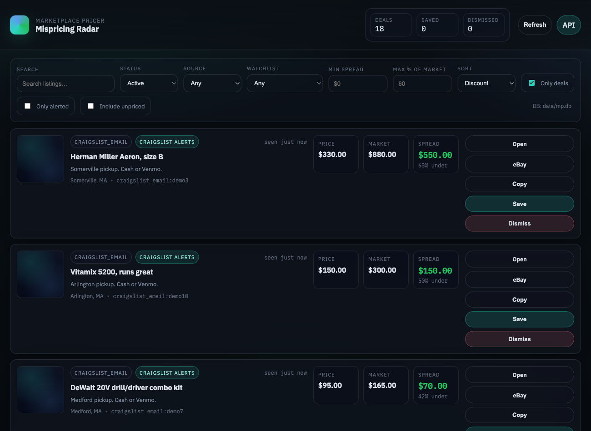
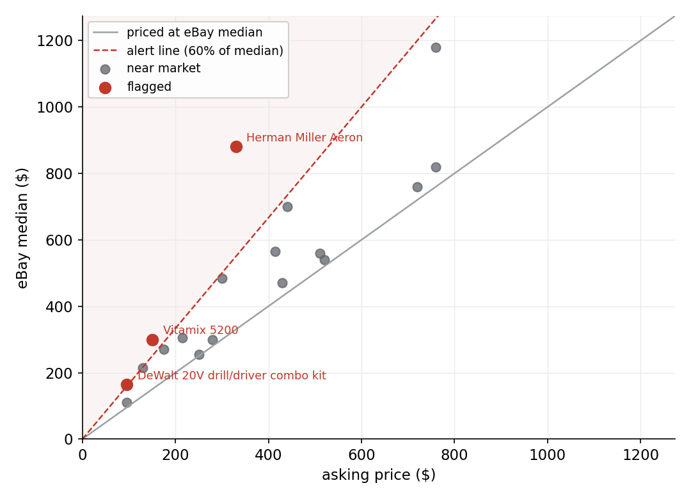

# Marketplace Pricer

I'm Roy Vaid. I run this on my laptop to catch listings on Facebook Marketplace and Craigslist that are going for well under their eBay price, and to get a ping when one shows up.

It started with an annoyance: the same used item sells for very different prices depending on where it is listed, and nobody selling an old camera on Facebook is checking what that camera closes for on eBay. Baye, Morgan and Scholten measured the gap years ago on an actual price comparison site, where buyers could see every offer at once, and the two lowest prices for identical electronics still differed by about 23 percent on average ([paper](https://ideas.repec.org/a/bla/jindec/v52y2004i4p463-496.html)). Marketplaces where buyers cannot compare are looser than that. I wanted to see how loose.

## How it works

A watchlist is a search ("iphone 14" near Boston, capped at $600) tied to a source and a scan interval. The scanner pulls current listings, looks each title up against the eBay Browse API, and takes the median of the comps as a rough market price. Facebook needs a real login, so the first run opens a browser and waits for me to sign in, then reuses that session on later scans. Craigslist comes in through saved-search email alerts over IMAP rather than scraping. Everything lands in a local SQLite file.

A listing gets flagged when its asking price drops under a fraction of the eBay median I set per watchlist, 60 percent by default. Flags print to the console, and go to Discord or Telegram if I fill in the keys.

## What it looks like



The local dashboard, sorted by how far each listing sits under its eBay median. Save and dismiss write back to the database.



Each point is a listing from one set of scans. Most sit near the gray line, where the asking price matches the eBay median. The few that cross the dashed line, priced at or below 60 percent of median, are the ones worth a message.

## Running it

```bash
python -m venv .venv && source .venv/bin/activate
pip install -r requirements.txt
playwright install chromium
python -m marketplace_pricer init-db
```

Log in to Facebook once. This opens a browser; sign in, then press Enter in the terminal to save the session:

```bash
python -m marketplace_pricer facebook-login
```

Add a watchlist, run the scanner, open the dashboard:

```bash
python -m marketplace_pricer watchlist add \
  --name "iPhone 14 (Boston)" \
  --source facebook \
  --query "iphone 14" \
  --filters '{"city":"boston","max_price":600,"alert_under_market_pct":0.6}' \
  --interval 300

python -m marketplace_pricer scan run
python -m marketplace_pricer ui --open
```

eBay comps, Discord, Telegram and Craigslist email each read their keys from `.env`; copy `.env.example` and fill in whichever you want. Without eBay keys you still get listings, there is just no market price to compare them against.

## A note

Scraping and automated access can break a site's terms and get an account banned. I keep this to my own use and lean on official APIs, eBay and the email route for Craigslist, where I can.
